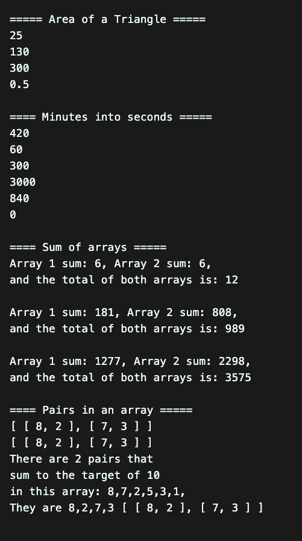

# Algo Race - Feb 26, 2022

## The Challenges:

    1.write a function that returns the area of a triangle. Easy (area of a triangle is just base\*height/2)
    2.Turn minutes into seconds using a function. Example 1 min: output = 60 seconds 3 mins: output = 180 seconds. Easy
    3.Write a function that returns the sum of two given arrays and the sum of those arrays together
    example: [1,2,3], [1,2,3] = [6], [6] output:12. medium
    4.Given an unsorted integer array, find a pair with the given sum in it. Hard
    Input:

    nums = [8, 7, 2, 5, 3, 1]
    target = 10

    Output:

    Pair found (8, 2)
    or
    Pair found (7, 3)

## My Output:



## My Code (condensed):

```js
console.log();

function areaOfTriangle(base, height) {
  let area = (base * height) / 2;
  return area;
}
console.log(areaOfTriangle(13, 20));

function minutesToSeconds(minutes) {
  return minutes * 60;
}
console.log(minutesToSeconds(14));

function arrayAddition(arr1, arr2) {
  let sum1 = 0;
  let sum2 = 0;
  let output = 0;
  for (var i = 0; i < arr1.length; i++) {
    sum1 += arr1[i];
  }
  for (var i = 0; i < arr2.length; i++) {
    sum2 += arr2[i];
  }
  output = sum1 + sum2;
  return [sum1, sum2, output];
}

console.log(arrayAddition([1, 2, 3], [1, 2, 3]));

var array = [8, 7, 2, 5, 3, 1];
var target = 10;

function pairInArray(arr, target) {
  let pairs = [];
  for (var i = 0; i < arr.length - 1; i++) {
    for (var j = i + 1; j < arr.length; j++) {
      if (arr[i] + arr[j] == target) {
        pairs.push([arr[i], arr[j]]);
      }
    }
  }
  return pairs;
}

console.log(pairInArray(array, target));
```
